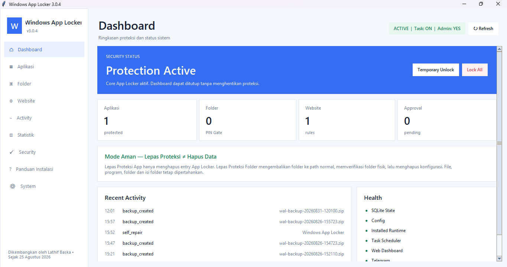
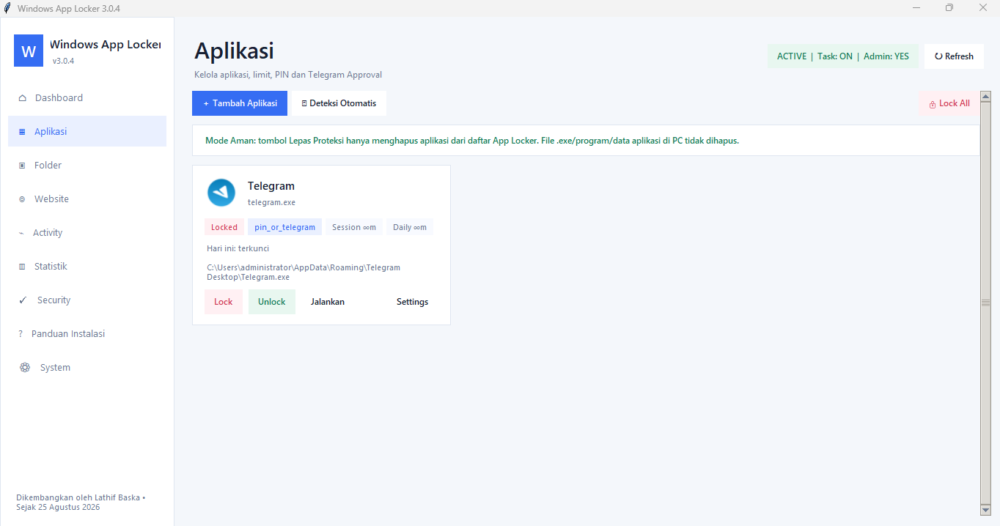
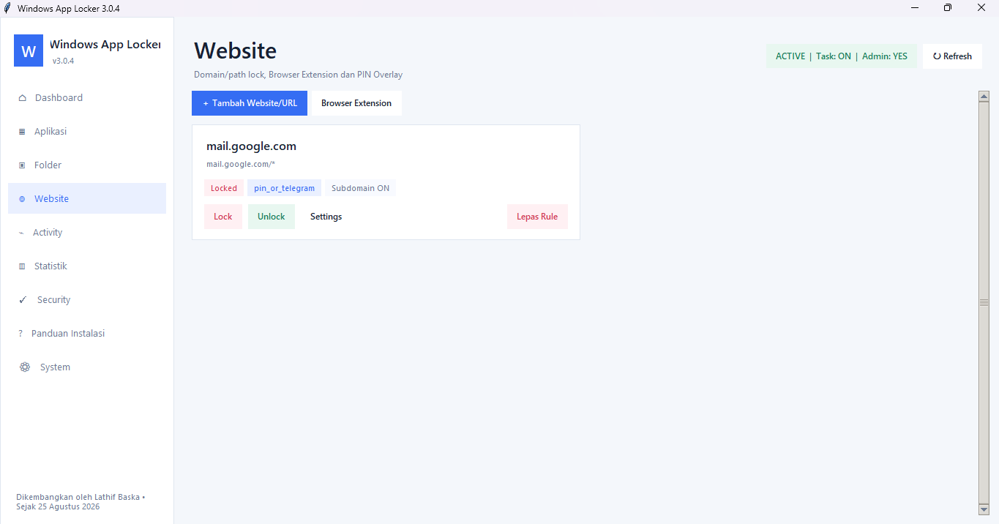
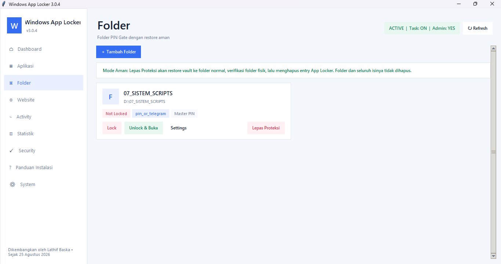
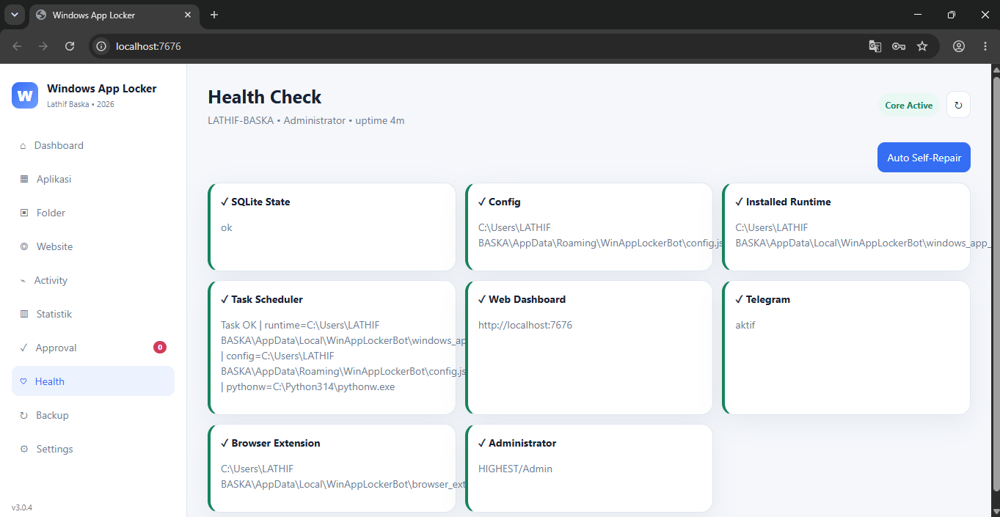

# Windows App Locker

[](https://github.com/baska-pro/windows-app-locker/actions/workflows/ci.yml)
[](https://github.com/baska-pro/windows-app-locker/releases/latest)
[](LICENSE)
[](#requirements)
[](#requirements)

> [Dokumentasi Bahasa Indonesia](README.md)

**Windows App Locker v2.0.0** is a per-user Windows application locker with a local dashboard, PIN-based temporary unlock, system tray operation, per-user autostart, logging, and owner-only Telegram control.

> This project is not a replacement for Windows AppLocker, WDAC, Group Policy, or a kernel-level security boundary. A Windows Administrator can still stop or bypass the application.

## Screenshots

<p align="center">
  
  
</p>

<p align="center">
  
  
</p>

<p align="center">
  
</p>

> Screenshots are stored under [`assets/screenshots/`](assets/screenshots/) and must never expose Telegram tokens, PINs, private Chat IDs, credentials, or other sensitive data.

## Highlights

- PBKDF2-HMAC-SHA256 PIN record with random salt.
- Telegram bot token protected with Windows DPAPI.
- Registered-process monitoring with exact executable-path preference.
- Temporary unlock and controlled launch for registered applications only.
- Searchable GUI, context menu, enable/disable protection, settings, help, and system tray.
- Transparent per-user autostart through HKCU Run.
- Owner-only Telegram commands and inline control menu.
- Rotating logs, configuration recovery, notification throttling, and single-instance protection.
- PowerShell installer/uninstaller and GitHub Actions CI.

## Requirements

- Windows 10/11.
- Python 3.10+.
- Internet access if Telegram is enabled.
- Administrator privileges are not required for the default per-user installation.

## Install

```powershell
git clone https://github.com/baska-pro/windows-app-locker.git
cd windows-app-locker
powershell -ExecutionPolicy Bypass -File .\install.ps1
```

The installer creates a virtual environment, installs dependencies, copies the project to `%LOCALAPPDATA%\Programs\WindowsAppLocker`, creates Start Menu/Desktop shortcuts, and launches the first-run setup.

Manual installation:

```powershell
python -m pip install -r requirements.txt
python windows_app_locker.py
```

## First-run setup

On first launch:

1. Enter the Telegram Bot Token from BotFather.
2. Enter the owner's Telegram Chat ID.
3. Create a PIN with at least 4 characters.
4. Optionally select `.exe` applications to protect immediately.
5. Choose whether per-user autostart should be enabled.

The configuration is stored at `%APPDATA%\WinAppLockerBot\config.json`. The Telegram token is not stored there in plaintext.

## Telegram commands

```text
/menu
/status
/apps
/lock <app>
/unlock <app> [minutes]
/lockall
/unlockall [minutes]
/launch <app> [minutes]
/pause [minutes]
/resume
/logs [count]
/ping
/help
```

Telegram control accepts only the configured owner Chat ID. `/launch` can launch registered applications only; arbitrary shell execution is intentionally excluded.

See [docs/TELEGRAM.md](docs/TELEGRAM.md) for the complete guide.

## Diagnostics

```powershell
python windows_app_locker.py --version
python windows_app_locker.py --doctor
python windows_app_locker.py --show-data-dir
```

Session options:

```powershell
python windows_app_locker.py --background
python windows_app_locker.py --no-telegram
python windows_app_locker.py --no-monitor
```

`--no-monitor` is intended for troubleshooting and disables enforcement while that process is running.

## Repository structure

```text
windows-app-locker/
├─ .github/
│  ├─ ISSUE_TEMPLATE/
│  ├─ workflows/ci.yml
│  └─ pull_request_template.md
├─ assets/
│  └─ screenshots/
│     ├─ dashboard.png
│     ├─ aplikasi.png
│     ├─ website.png
│     ├─ folder.png
│     └─ health.png
├─ docs/
├─ scripts/
├─ windows_app_locker.py
├─ install.ps1
├─ uninstall.ps1
├─ requirements.txt
├─ VERSION
├─ CHANGELOG.md
├─ SECURITY.md
├─ CONTRIBUTING.md
├─ LICENSE
├─ README.en.md
└─ README.md
```

## Runtime data

Default location:

```text
%APPDATA%\WinAppLockerBot\
├─ config.json
└─ app_locker.log
```

Runtime and credential files must not be committed. The repository already includes an appropriate `.gitignore`.

## Limitations

- This is a user-level locker, not a kernel-level security boundary.
- A Windows Administrator can stop the application or remove its autostart entry.
- Enforcement is process-monitoring based, so some applications may briefly appear before being terminated.
- Microsoft Store/UWP applications do not always expose traditional executables suitable for this model.
- Core Windows processes and the Python interpreter running Windows App Locker are blocked from the protection list to prevent self-locking.

## Documentation

- [Bahasa Indonesia README](README.md)
- [Installation](docs/INSTALLATION.md)
- [Telegram](docs/TELEGRAM.md)
- [Troubleshooting](docs/TROUBLESHOOTING.md)
- [Security Model](docs/SECURITY_MODEL.md)
- [Publishing to GitHub](docs/PUBLISH_GITHUB.md)

## License

Personal/private/non-commercial viewing, use, study, testing, and modification are permitted. Redistribution, resale, rebranding, public republishing, SaaS, and commercial use require prior written permission. See [LICENSE](LICENSE).
